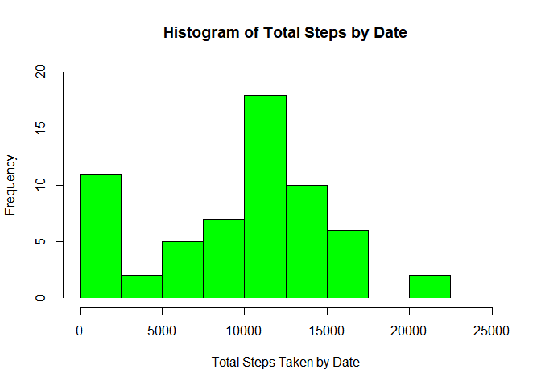
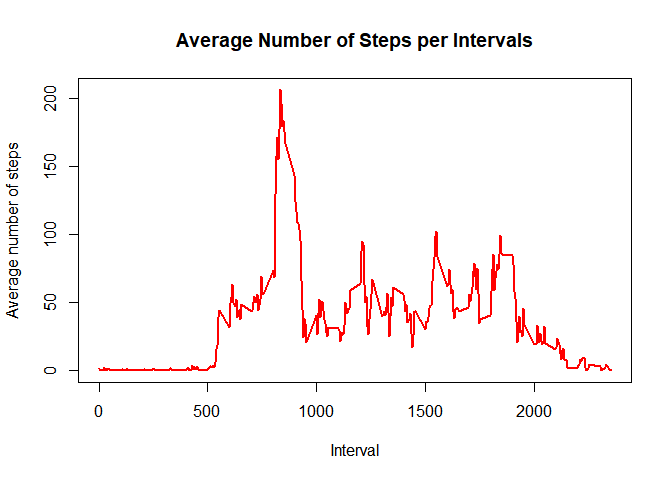
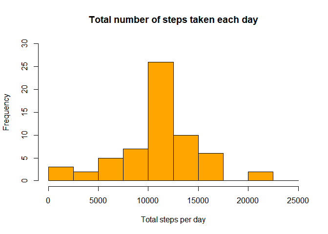
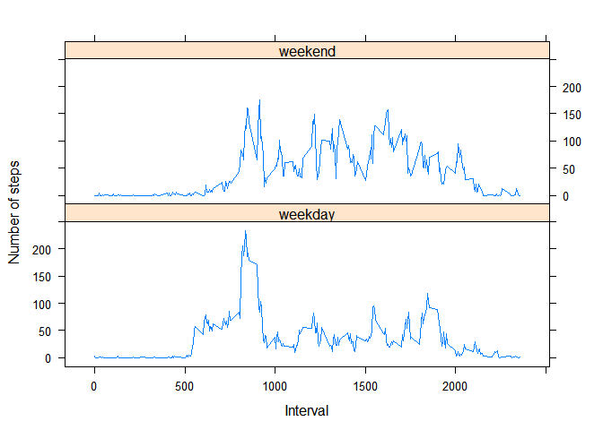

## Loading and preprocessing the data


```r
library(ggplot2)


activity <- read.csv(unz("activity.zip", "activity.csv"))
str(activity)
```

```
## 'data.frame':	17568 obs. of  3 variables:
##  $ steps   : int  NA NA NA NA NA NA NA NA NA NA ...
##  $ date    : Factor w/ 61 levels "2012-10-01","2012-10-02",..: 1 1 1 1 1 1 1 1 1 1 ...
##  $ interval: int  0 5 10 15 20 25 30 35 40 45 ...
```

```r
#Since the class types are integer and factor, I will read in the data again. However, on this execution of the read.csv() function, I will add the #colClasses option to specify a numeric, Date and numeric column respectively.
activity$date <- as.Date(activity$date)
str(activity)
```

```
## 'data.frame':	17568 obs. of  3 variables:
##  $ steps   : int  NA NA NA NA NA NA NA NA NA NA ...
##  $ date    : Date, format: "2012-10-01" "2012-10-01" ...
##  $ interval: int  0 5 10 15 20 25 30 35 40 45 ...
```

```r
summary(activity)
```

```
##      steps             date               interval     
##  Min.   :  0.00   Min.   :2012-10-01   Min.   :   0.0  
##  1st Qu.:  0.00   1st Qu.:2012-10-16   1st Qu.: 588.8  
##  Median :  0.00   Median :2012-10-31   Median :1177.5  
##  Mean   : 37.38   Mean   :2012-10-31   Mean   :1177.5  
##  3rd Qu.: 12.00   3rd Qu.:2012-11-15   3rd Qu.:1766.2  
##  Max.   :806.00   Max.   :2012-11-30   Max.   :2355.0  
##  NA's   :2304
```


## What is mean total number of steps taken per day?

```r
Activity_sum_bydate <- tapply(activity$steps,activity$date,sum,na.rm=TRUE)
hist(Activity_sum_bydate, col= "green", xlab="Total Steps Taken by Date",main="Histogram of Total Steps by Date",ylim = c(0,20), breaks = seq(0,25000, by=2500))
```

<!-- -->

```r
#The mean and the median for the total number of steps per day isbelow:

mean(Activity_sum_bydate)
```

```
## [1] 9354.23
```

```r
median(Activity_sum_bydate)
```

```
## [1] 10395
```


## What is the average daily activity pattern?

### Make a time series plot of the 5-minute interval (x-axis) and the average number of steps taken, averaged across all days (y-axis)


```r
Average_Activity_Perday <- aggregate(activity$steps, by=list(activity$interval), FUN=mean, na.rm=TRUE)
names(Average_Activity_Perday) <- c("interval", "mean")
plot(Average_Activity_Perday$interval, Average_Activity_Perday$mean, type = "l", col="red", lwd = 2, xlab="Interval", ylab="Average number of steps", main="Average Number of Steps per Intervals")
```

<!-- -->

#### Next is to check which 5-minute interval, on average across all the days in the dataset, contains the maximum number of steps:

```r
Average_Activity_Perday[which.max(Average_Activity_Perday$mean), ]$interval
```

```
## [1] 835
```

## Imputing missing values
####There are a number of days/intervals where there are missing values (NA). Calculate and report the total number of missing values in the dataset


```r
sum(is.na(activity$steps))
```

```
## [1] 2304
```

#### Steps for filling in all of the missing values in the dataset.

```r
added_steps <- Average_Activity_Perday$mean[match(activity$interval, Average_Activity_Perday$interval)]
```
####Create a new dataset that is equal to the original dataset but with the missing data filled in.


```r
activity_added <- transform(activity, steps = ifelse(is.na(activity$steps), yes = added_steps, no = activity$steps))
total_steps_added <- aggregate(steps ~ date, activity_added, sum)
names(total_steps_added) <- c("date", "daily_steps")
class(activity_added)
```

```
## [1] "data.frame"
```

```r
head(activity_added)
```

```
##       steps       date interval
## 1 1.7169811 2012-10-01        0
## 2 0.3396226 2012-10-01        5
## 3 0.1320755 2012-10-01       10
## 4 0.1509434 2012-10-01       15
## 5 0.0754717 2012-10-01       20
## 6 2.0943396 2012-10-01       25
```

####M histogram of the total number of steps taken each day 


```r
hist(total_steps_added$daily_steps, col = "orange", xlab = "Total steps per day", ylim = c(0,30), main = "Total number of steps taken each day", breaks = seq(0,25000,by=2500))
```

<!-- -->

####Here is the mean of the total number of steps taken per day:

```r
mean(total_steps_added$daily_steps)
```

```
## [1] 10766.19
```

####Here is the median of the total number of steps taken per day:

```r
median(total_steps_added$daily_steps)
```

```
## [1] 10766.19
```


## Are there differences in activity patterns between weekdays and weekends?


####Create a new factor variable in the dataset with two levels - "weekday" and "weekend" indicating whether a given date is a weekday or weekend day.


```r
is_weekday <- function(x) {
      wd <- weekdays(x)
      ifelse (wd == "Saturday" | wd == "Sunday", "weekend", "weekday")
}
wk <- sapply(activity$date, is_weekday)
activity$week <- as.factor(wk)
```

#### Make a panel plot containing a time series plot of the 5-minute interval (x-axis) and the average number of steps taken.


```r
activity <- na.omit(activity)
activity1<- aggregate(steps ~ week+interval, data=activity, FUN=mean)

library(lattice)
xyplot(steps ~ interval | factor(week),
              layout = c(1, 2),
              xlab="Interval",
              ylab="Number of steps",
              type="l",
              data=activity1)
```

<!-- -->


